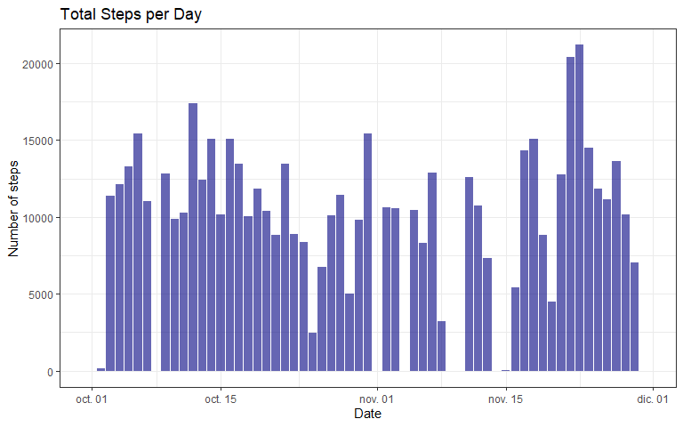

## Loading and preprocessing the data
First, the data is loaded with the `read.csv()` function. The csv file is in a 
zip file, so we will unzip it before with the `unzip()` function, and save it
in the object `data`, then we will use the `head()` function with `data` to look
at the first rows:

```r
unzip("./activity.zip")
data <- read.csv("activity.csv", header = TRUE)
head(data)
```

```
##   steps       date interval
## 1    NA 2012-10-01        0
## 2    NA 2012-10-01        5
## 3    NA 2012-10-01       10
## 4    NA 2012-10-01       15
## 5    NA 2012-10-01       20
## 6    NA 2012-10-01       25
```
The data set contains three variables:  
        1. **steps**: Number of steps taking in a 5-minute interval (missing values are coded
as NA).  
        2. **date**: The date on which the measurement was taken in YYYY-MM-DD format.  
        3. **interval**: Identifier for the 5-minute interval in which measurement was taken.  

Now we will use the `dim()` function to look at the dimensions of the data set:

```r
dim(data)
```

```
## [1] 17568     3
```
As we can see, the data set contains 17,568 observations of the 3 previously
mentioned variables. Now let's take a look at the structure of the variables 
with the `str()` function:

```r
str(data)
```

```
## 'data.frame':	17568 obs. of  3 variables:
##  $ steps   : int  NA NA NA NA NA NA NA NA NA NA ...
##  $ date    : chr  "2012-10-01" "2012-10-01" "2012-10-01" "2012-10-01" ...
##  $ interval: int  0 5 10 15 20 25 30 35 40 45 ...
```
The steps and interval variable are both integers, but the date variable is a 
character variable, so we will change it to a date variable with the function
`as.Date()` specifying the format (YYY-MM-DD):

```r
data$date <- as.Date(data$date, "%Y-%m-%d")
str(data)
```

```
## 'data.frame':	17568 obs. of  3 variables:
##  $ steps   : int  NA NA NA NA NA NA NA NA NA NA ...
##  $ date    : Date, format: "2012-10-01" "2012-10-01" ...
##  $ interval: int  0 5 10 15 20 25 30 35 40 45 ...
```
Now the date variable is in Date format, this will make data manipulation much
easier. It's important to keep in mind that there are missing values.

## What is mean total number of steps taken per day?
For the next steps we will use the **tidyverse** package, wich contains the *ggplot*
and *dplyr* packages.

Now we will plot a histogram of the total number of steps taken each day. To do 
this, we will first create another data set with the total number of steps for
each day. We will use the `group_by` and `summarise` functions from the *dplyr*
package, and we will assign the new data set to the object `data_sum`:

```r
data_sum <- data %>% group_by(date) %>% 
        summarise(steps = sum(steps, na.rm = TRUE))
head(data_sum)
```

```
## # A tibble: 6 x 2
##   date       steps
##   <date>     <int>
## 1 2012-10-01     0
## 2 2012-10-02   126
## 3 2012-10-03 11352
## 4 2012-10-04 12116
## 5 2012-10-05 13294
## 6 2012-10-06 15420
```
Now we will create a histogram with `ggplot()`

```r
g <- ggplot(data_sum, aes(x = date, y = steps), na.rm = TRUE)
g + geom_col(fill = "navyblue", alpha = 0.6) +
        labs(title = "Total Steps per Day", 
             x = "Date", y = "Number of steps") +
        theme_bw()
```


Now we will calculate the **mean** and **median** total number of steps taken
each day. Once again we will use the `group_by` and `summarise` functions from
the *dplyr* package.  
First we will filter out any NA value, to avoid troubles. Then, we will create a
data set called `data_median` with the median total steps for each day:

```r
data <- data %>% filter(!is.na(steps))
data_median <- data %>% filter(!is.na(steps)) %>%
        group_by(date) %>% summarise(median = median(steps, na.rm = TRUE))
head(data_median)
```

```
## # A tibble: 6 x 2
##   date       median
##   <date>      <dbl>
## 1 2012-10-02      0
## 2 2012-10-03      0
## 3 2012-10-04      0
## 4 2012-10-05      0
## 5 2012-10-06      0
## 6 2012-10-07      0
```

## What is the average daily activity pattern?


## Imputing missing values


## Are there differences in activity patterns between weekdays and weekends?
