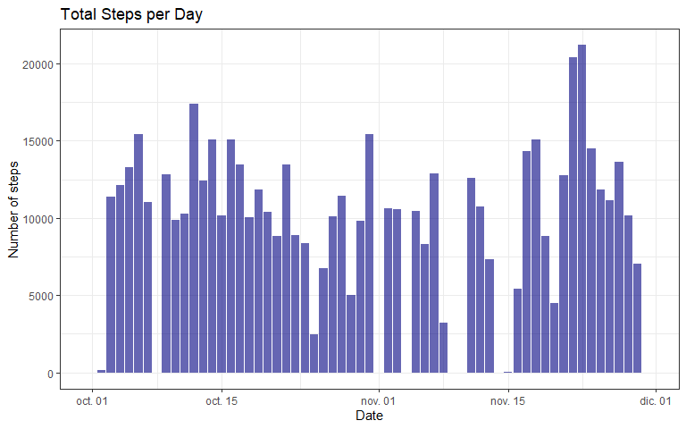
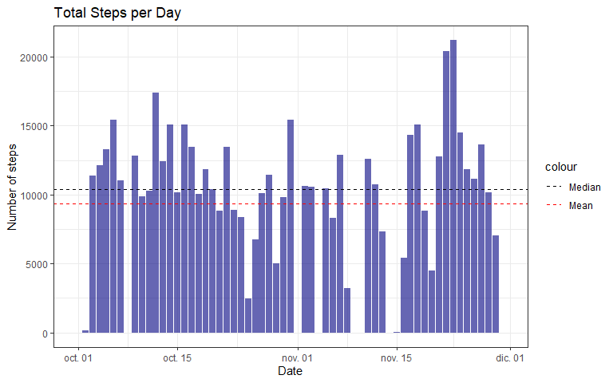
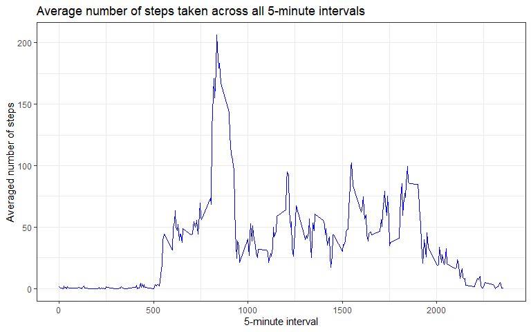
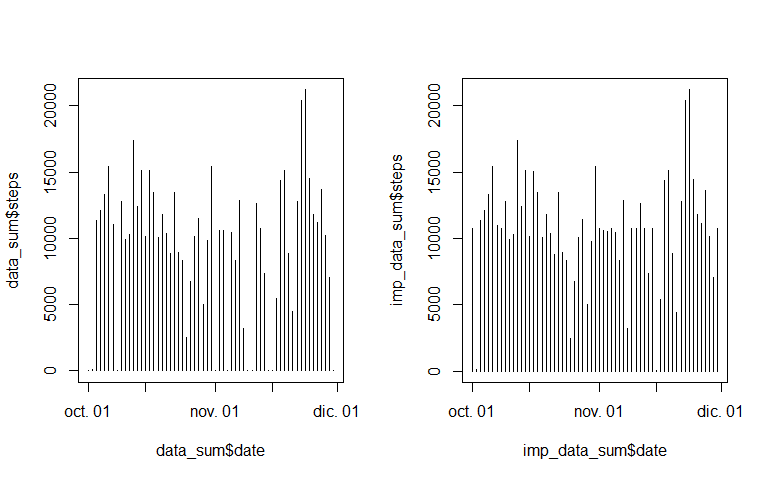
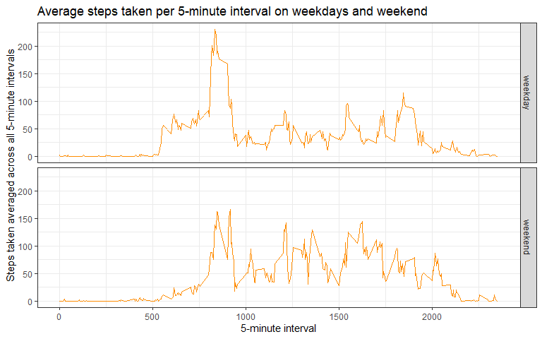

## Introduction
For this assignment we will be working with data from a personal activity 
monitoring device, which collects data at 5 minute intervals.. The data consists
of two months of monitoring from an anonymous individual, collected during the 
months of October and November 2012.

## Loading and preprocessing the data
First, we will load the data with the `read.csv()` function. The csv file is in a 
zip file, so we will have to unzip it before with the `unzip()` function, and 
store it in an object called `data`. Then we will use the `head()` function with 
`data` to look at the first 6 rows:


```r
unzip("./activity.zip")
data <- read.csv("activity.csv", header = TRUE)
head(data)
```

```
##   steps       date interval
## 1    NA 2012-10-01        0
## 2    NA 2012-10-01        5
## 3    NA 2012-10-01       10
## 4    NA 2012-10-01       15
## 5    NA 2012-10-01       20
## 6    NA 2012-10-01       25
```
The data set contains three variables:  
        1. **steps**: Number of steps taking in a 5-minute interval (missing values are coded
as NA).  
        2. **date**: The date on which the measurement was taken in YYYY-MM-DD format.  
        3. **interval**: Identifier for the 5-minute interval in which measurement was taken.  

WE can also note that there are missing values. Now we will use the `dim()`
function to look at the dimensions of the data set:


```r
dim(data)
```

```
## [1] 17568     3
```
The data set contains 17,568 observations of the 3 previously
mentioned variables. Now let's take a look at the structure of the variables 
with the `str()` function:


```r
str(data)
```

```
## 'data.frame':	17568 obs. of  3 variables:
##  $ steps   : int  NA NA NA NA NA NA NA NA NA NA ...
##  $ date    : chr  "2012-10-01" "2012-10-01" "2012-10-01" "2012-10-01" ...
##  $ interval: int  0 5 10 15 20 25 30 35 40 45 ...
```
The steps and interval variable are both integers, but the date variable is a 
character variable, so we will change it to a date variable with the function
`as.Date()` specifying the format (YYYY-MM-DD):


```r
data$date <- as.Date(data$date, "%Y-%m-%d")
str(data)
```

```
## 'data.frame':	17568 obs. of  3 variables:
##  $ steps   : int  NA NA NA NA NA NA NA NA NA NA ...
##  $ date    : Date, format: "2012-10-01" "2012-10-01" ...
##  $ interval: int  0 5 10 15 20 25 30 35 40 45 ...
```
Now the date variable is in Date format, this will make data manipulation much
easier.

## What is mean total number of steps taken per day?
For the next steps we will use the *ggplot* and *dplyr* packages. we will load 
them with `library()` function.


```r
library(dplyr)
library(ggplot2)
```
Now we will plot a histogram of the total number of steps taken each day. To do 
this, we will first create another data set with the total number of steps for
each day. We will use the `group_by()` and `summarise()` functions from the *dplyr*
package, and we will assign the new data set to the object `data_sum`:


```r
data_sum <- data %>% group_by(date) %>% 
  summarise(steps = sum(steps, na.rm = TRUE))
head(data_sum)
```

```
## # A tibble: 6 x 2
##   date       steps
##   <date>     <int>
## 1 2012-10-01     0
## 2 2012-10-02   126
## 3 2012-10-03 11352
## 4 2012-10-04 12116
## 5 2012-10-05 13294
## 6 2012-10-06 15420
```
Now we got a data frame with the variable 'date' in one column, and the total number
of steps for each specific day in the 'steps' column. Let's create a histogram
with `ggplot()`.


```r
g <- ggplot(data_sum, aes(x = date, y = steps), na.rm = TRUE)
g + geom_col(fill = "navyblue", alpha = 0.6) +
        labs(title = "Total Steps per Day", 
             x = "Date", y = "Number of steps") +
        theme_bw()
```


Now we will calculate the mean and median with the `mean()` and `median()`
function.


```r
median(data_sum$steps)
```

```
## [1] 10395
```

```r
mean(data_sum$steps)
```

```
## [1] 9354.23
```
The median total number of daily steps was 10,395 and the mean total number of 
daily steps was 9354.23. It would be better to visualize this data on the previous 
plot.


```r
g <- ggplot(data_sum, aes(x = date, y = steps), na.rm = TRUE)
g + geom_col(fill = "navyblue", alpha = 0.6) +
        labs(title = "Total Steps per Day", 
             x = "Date", y = "Number of steps") +
  geom_hline(aes(yintercept = mean(steps), colour = "Mean"), 
             linetype = "dashed") +
  geom_hline(aes(yintercept = median(steps), colour = "Median"), 
             linetype = "dashed") +
  scale_colour_manual(values = c("Median" = "black", "Mean" = "red")) +
        theme_bw()
```



## What is the average daily activity pattern?

First we will filter out any NA value, to avoid troubles. Then, we will create a
data set called `data_mean` with the median total steps for each day:


```r
data2 <- data %>% filter(!is.na(steps))
interval_mean <- data2 %>% 
  group_by(interval) %>% 
  summarise(mean = mean(steps, na.rm = TRUE))
head(interval_mean)
```

```
## # A tibble: 6 x 2
##   interval   mean
##      <int>  <dbl>
## 1        0 1.72  
## 2        5 0.340 
## 3       10 0.132 
## 4       15 0.151 
## 5       20 0.0755
## 6       25 2.09
```
Let's create a time series plot, with the 5-minute intervals on the x-axis, and
the average number of steps taken, averaged across all day on the y-axis.


```r
t <- ggplot(interval_mean, aes(x = interval, y = mean))
t + geom_line(color = "blue") +
  labs(title = "Average number of steps taken across all 5-minute intervals", 
       x = "5-minute interval", y = "Averaged number of steps") + 
  theme_bw()
```


Let's see which 5-minute interval contains the maximum number of steps, using the
`max()` function, to get the largest value from the 'mean' column.

```r
max(interval_mean$mean)
```

```
## [1] 206.1698
```
Now we will use the `which()` function to find the row that contains the max value, 
and then subset the corresponding row using square brackets to select the specified
row.


```r
interval_mean[which(interval_mean$mean == max(interval_mean$mean)), ]
```

```
## # A tibble: 1 x 2
##   interval  mean
##      <int> <dbl>
## 1      835  206.
```
## Imputing missing values
How do the missing values affect the data? First let's see how many NA's we got
in our data, using the `summary()` function with a call to the object `data`.


```r
summary(data)
```

```
##      steps             date               interval     
##  Min.   :  0.00   Min.   :2012-10-01   Min.   :   0.0  
##  1st Qu.:  0.00   1st Qu.:2012-10-16   1st Qu.: 588.8  
##  Median :  0.00   Median :2012-10-31   Median :1177.5  
##  Mean   : 37.38   Mean   :2012-10-31   Mean   :1177.5  
##  3rd Qu.: 12.00   3rd Qu.:2012-11-15   3rd Qu.:1766.2  
##  Max.   :806.00   Max.   :2012-11-30   Max.   :2355.0  
##  NA's   :2304
```

```r
mean(is.na(data$steps))
```

```
## [1] 0.1311475
```
There are 2,304 missing values in our data, which corresponds to 13.11% of the
data.  
We will impute those missing values with the mean for the corresponding 5-minute
interval, using `for()` and `if()` loops, creating a new data frame with the
imputed values.


```r
imp_data <- data
for(i in 1:nrow(imp_data)){
  if(is.na(imp_data[i, "steps"]) == TRUE){
    int <- imp_data[i, "interval"]
    imp_row <- filter(interval_mean, interval == int)
    imp_mean <- imp_row[, 2]
    imp_data[i, "steps"] <- imp_mean
  } 
}
```
Now let's summarize the total number of steps in a new data frame, just as we did
before with the first data frame.


```r
imp_data_sum <- imp_data %>% group_by(date) %>% 
  summarise(steps = sum(steps))
head(imp_data_sum)
```

```
## # A tibble: 6 x 2
##   date        steps
##   <date>      <dbl>
## 1 2012-10-01 10766.
## 2 2012-10-02   126 
## 3 2012-10-03 11352 
## 4 2012-10-04 12116 
## 5 2012-10-05 13294 
## 6 2012-10-06 15420
```
Now let's compare the mean and median total number of steps per day, just as
before.


```r
median(imp_data_sum$steps)
```

```
## [1] 10766.19
```

```r
mean(imp_data_sum$steps)
```

```
## [1] 10766.19
```
Both values have changed, and both the median and mean now have the same value.
This is due to the large quantity of missing values that the original data frame
contained.  
Let's plot a histogram for the total number of steps per day from the new data frame
with the imputed values, with the corresponding new mean and median, so we can 
visualize the difference from the previous plot.


```r
g <- ggplot(imp_data_sum, aes(x = date, y = steps), na.rm = TRUE)
g + geom_col(fill = "navyblue", alpha = 0.6) +
        labs(title = "Total Steps per Day", 
             x = "Date", y = "Number of steps") +
  geom_hline(aes(yintercept = mean(steps), colour = "Mean")) +
  geom_hline(aes(yintercept = median(steps), colour = "Median"), 
             linetype = "dashed") +
  scale_colour_manual(values = c("Median" = "green", "Mean" = "black")) +
        theme_bw()
```


Now let's make a quick exploratory plot to compare how the number of steps taken
per day have changed in both data frames.


```r
par(mfrow = c(1, 2))
plot(data_sum$date, data_sum$steps, type = "h")
plot(imp_data_sum$date, imp_data_sum$steps, type = "h")
```


It's evident that there has been some changes in a few days with our imputed data.
The amount of days that have changed may not be many, but since the original value
for those days was 0 or nearly 0, the mean and median for the total number of steps
taken per day from the new data frame with the imputed values has been largely
affected.

## Are there differences in activity patterns between weekdays and weekends?
We will add a new variable to the data frame we just created, the each observation
will be one of two values, weekday or weekend, indicating whether a given date 
is a weekday or weekend day.


```r
day_data <- imp_data
day_data$day <- ifelse(weekdays(data$date) %in% c("sábado", "domingo"), 
                             "weekend", "weekday")
day_data$day <- as.factor(day_data$day)
day_data_mean <- day_data %>% group_by(interval, day) %>%
  summarise(mean = mean(steps))
head(day_data_mean)
```

```
## # A tibble: 6 x 3
## # Groups:   interval [3]
##   interval day       mean
##      <int> <fct>    <dbl>
## 1        0 weekday 2.25  
## 2        0 weekend 0.215 
## 3        5 weekday 0.445 
## 4        5 weekend 0.0425
## 5       10 weekday 0.173 
## 6       10 weekend 0.0165
```
Now we will make a time series plot to compare the difference in the averaged
number of steps per 5-minute interval between weekdays and weekend days.


```r
h <- ggplot(day_data_mean, aes(x = interval, y = mean))
h + facet_grid(rows = vars(day)) +
  geom_line(color = "darkorange") + 
  labs(title = "Average steps taken per 5-minute interval on weekdays and weekend", 
       x = "5-minute interval", y = "Steps taken averaged across all 5-minute intervals") +
  theme_bw()
```


